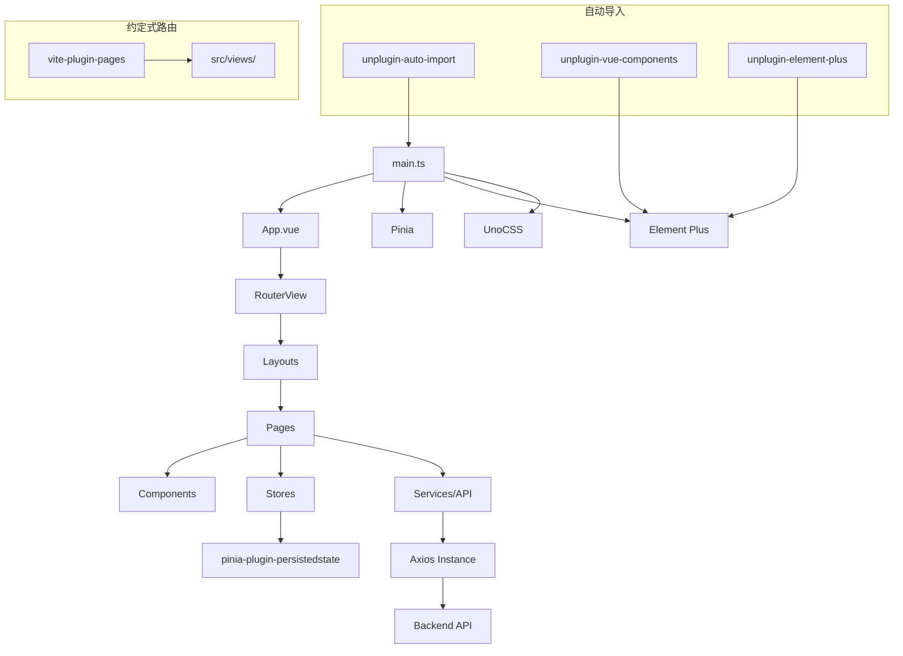
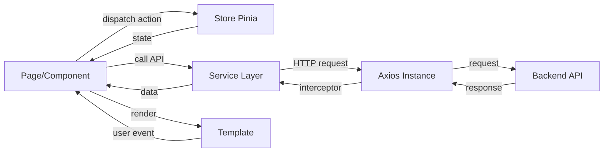

# One-Sentence-Generate-Page 项目初始化计划

## 概述

基于用户指定的技术栈，初始化一个现代化的 Vue 3 前端项目。项目名为 `one-sentence-generate-page`，核心功能为"一句话生成页面"。

## 技术栈

| 类别 | 技术 | 说明 |
|------|------|------|
| 构建工具 | Vite 6+ | 现代前端构建工具，极速 HMR |
| 前端框架 | Vue 3.5+ | Composition API + `<script setup lang="ts">` |
| 开发语言 | TypeScript 5.7+ | 类型安全，严格模式 |
| 路由管理 | Vue Router 4 + vite-plugin-pages | 约定式路由，文件即路由 |
| 状态管理 | Pinia 3 + pinia-plugin-persistedstate | 类型安全，支持持久化 |
| UI 组件库 | Element Plus 2.9+ | 按需导入，国内最流行 |
| CSS 方案 | UnoCSS 0.65+ | 原子化 CSS，高性能 |
| HTTP 请求 | Axios 1.7+ | 请求/响应拦截器封装 |

## 项目目录结构

```
one-sentence-generate-page/
├── index.html
├── package.json
├── tsconfig.json
├── tsconfig.node.json
├── tsconfig.app.json
├── vite.config.ts
├── unocss.config.ts
├── env.d.ts
├── public/
│   └── favicon.ico
└── src/
    ├── main.ts                    # 应用入口
    ├── App.vue                    # 根组件
    ├── env.d.ts                   # 类型声明
    ├── views/                     # 约定式路由页面
    │   ├── index.vue              # 首页 /
    │   ├── about.vue              # 关于页 /about
    │   └── user/                  # 多级路由
    │       ├── profile.vue        # /user/profile
    │       └── [id].vue           # /user/:id 动态路由
    ├── layouts/                   # 布局组件
    │   └── default.vue            # 默认布局
    ├── components/                # 公共组件
    │   └── HelloWorld.vue
    ├── composables/               # 组合式函数
    │   └── useCounter.ts
    ├── stores/                    # Pinia 状态管理
    │   └── counter.ts
    ├── services/                  # API 服务层
    │   ├── http.ts                # Axios 封装
    │   └── api/                   # 各模块 API
    │       └── example.ts
    ├── styles/                    # 全局样式
    │   ├── main.css               # 全局样式入口
    │   └── variables.css          # CSS 变量
    └── utils/                     # 工具函数
        └── index.ts
```

## 依赖清单

### 生产依赖

| 包名 | 版本 | 用途 |
|------|------|------|
| `vue` | ^3.5.0 | 前端框架 |
| `vue-router` | ^4.5.0 | 路由管理 |
| `pinia` | ^3.0.0 | 状态管理 |
| `pinia-plugin-persistedstate` | ^4.2.0 | Pinia 持久化 |
| `element-plus` | ^2.9.0 | UI 组件库 |
| `axios` | ^1.7.0 | HTTP 请求 |
| `@element-plus/icons-vue` | ^2.3.0 | Element Plus 图标 |

### 开发依赖

| 包名 | 版本 | 用途 |
|------|------|------|
| `vite` | ^6.0.0 | 构建工具 |
| `@vitejs/plugin-vue` | ^5.2.0 | Vite Vue 插件 |
| `@vitejs/plugin-vue-jsx` | ^4.1.0 | Vite JSX 支持 |
| `vite-plugin-pages` | ^0.32.0 | 约定式路由 |
| `unplugin-vue-components` | ^0.28.0 | 组件按需导入 |
| `unplugin-auto-import` | ^0.19.0 | API 自动导入 |
| `unplugin-element-plus` | ^0.5.0 | Element Plus 按需导入 |
| `unocss` | ^0.65.0 | 原子化 CSS |
| `@unocss/preset-uno` | ^0.65.0 | UnoCSS 默认预设 |
| `@unocss/preset-attributify` | ^0.65.0 | 属性化模式预设 |
| `@unocss/preset-icons` | ^0.65.0 | 图标预设 |
| `@unocss/transformer-directives` | ^0.65.0 | 指令转换器 |
| `@unocss/transformer-variant-group` | ^0.65.0 | 变体分组转换器 |
| `typescript` | ^5.7.0 | TypeScript 编译器 |
| `vue-tsc` | ^2.2.0 | Vue TypeScript 类型检查 |
| `@types/node` | ^22.0.0 | Node.js 类型定义 |

## 配置详情

### 1. Vite 配置 (`vite.config.ts`)

- 集成 `@vitejs/plugin-vue`
- 集成 `vite-plugin-pages` 实现约定式路由，页面目录为 `src/views`
- 集成 `unplugin-vue-components` 实现组件自动导入
- 集成 `unplugin-auto-import` 实现 Vue API 自动导入
- 集成 `unplugin-element-plus` 实现 Element Plus 按需导入样式
- 集成 `UnoCSS` Vite 插件
- 配置路径别名 `@` -> `src/`

### 2. TypeScript 配置

- `tsconfig.json`：根配置，引用 `tsconfig.app.json` 和 `tsconfig.node.json`
- `tsconfig.app.json`：应用代码配置，严格模式，路径别名 `@/*`
- `tsconfig.node.json`：Node 端配置（vite.config.ts 等）

### 3. UnoCSS 配置 (`unocss.config.ts`)

- 预设：`@unocss/preset-uno`、`@unocss/preset-attributify`、`@unocss/preset-icons`
- 转换器：`@unocss/transformer-directives`、`@unocss/transformer-variant-group`
- 自定义规则和 shortcuts（按需添加）

### 4. 约定式路由 (`vite-plugin-pages`)

- `vite-plugin-pages` 自动扫描 `src/views/` 目录生成路由
- 自动映射规则：
  - `src/views/index.vue` → `/`
  - `src/views/about.vue` → `/about`
  - `src/views/user/profile.vue` → `/user/profile`
  - `src/views/user/[id].vue` → `/user/:id`（动态路由）
- 支持嵌套路由（通过目录结构）
- 支持布局系统（通过 `src/layouts/`）

### 5. Axios 封装 (`src/services/http.ts`)

- 创建 Axios 实例，配置 `baseURL` 和超时
- 请求拦截器：自动添加 Token
- 响应拦截器：统一错误处理，401 自动跳转登录
- 导出 `get`、`post`、`put`、`delete` 等便捷方法

### 6. Pinia 配置 (`src/main.ts`)

- 创建 Pinia 实例
- 注册 `pinia-plugin-persistedstate` 插件
- 示例 Store 展示持久化用法

### 7. Element Plus 按需导入

- `unplugin-vue-components` 配置 `ElementPlusResolver`
- `unplugin-element-plus` 自动导入样式
- 无需手动 `import 'element-plus/dist/index.css'`

### 8. Auto Import 配置

- 自动导入 Vue 核心 API（`ref`、`computed`、`watch` 等）
- 自动导入 Vue Router API（`useRouter`、`useRoute` 等）
- 自动导入 Pinia API（`defineStore`、`storeToRefs` 等）
- 自动导入 Element Plus 组件和图标

## 执行步骤

### 步骤 1：初始化 Vite 项目

```bash
npm create vite@latest one-sentence-generate-page -- --template vue-ts
cd one-sentence-generate-page
```

### 步骤 2：安装核心依赖

```bash
# 生产依赖
npm install vue-router pinia pinia-plugin-persistedstate element-plus @element-plus/icons-vue axios

# 开发依赖
npm install -D @vitejs/plugin-vue-jsx vite-plugin-pages unplugin-vue-components unplugin-auto-import unplugin-element-plus unocss @unocss/preset-uno @unocss/preset-attributify @unocss/preset-icons @unocss/transformer-directives @unocss/transformer-variant-group @types/node
```

### 步骤 3：创建配置文件

- 重写 `vite.config.ts`
- 重写 `tsconfig.json` + 创建 `tsconfig.app.json` + `tsconfig.node.json`
- 创建 `unocss.config.ts`
- 创建 `env.d.ts`（类型声明）

### 步骤 4：创建项目目录结构

- 创建 `src/views/`、`src/layouts/`、`src/components/`、`src/composables/`、`src/stores/`、`src/services/`、`src/styles/`、`src/utils/`

### 步骤 5：创建入口文件

- `src/main.ts`：挂载应用，注册插件
- `src/App.vue`：根组件，使用 `<RouterView>`
- `src/styles/main.css`：全局样式

### 步骤 6：创建示例文件

- `src/views/index.vue`：首页
- `src/views/about.vue`：关于页
- `src/views/user/profile.vue`：用户资料页
- `src/views/user/[id].vue`：用户详情页（动态路由）
- `src/layouts/default.vue`：默认布局
- `src/stores/counter.ts`：示例 Store
- `src/services/http.ts`：Axios 封装
- `src/services/api/example.ts`：示例 API

### 步骤 7：验证项目

```bash
npm run dev
```

## 架构图



## 数据流



## 注意事项

1. **版本兼容性**：确保所有依赖版本兼容，特别是 `unplugin-vue-router` 与 `vue-router` 的版本匹配
2. **类型安全**：所有配置均使用 TypeScript，确保类型推导完整
3. **按需导入**：Element Plus 和 Vue API 均通过插件自动导入，无需手动 import
4. **路径别名**：统一使用 `@/` 作为 `src/` 的别名
5. **持久化**：Pinia Store 默认不持久化，仅在需要时通过 `persist: true` 开启